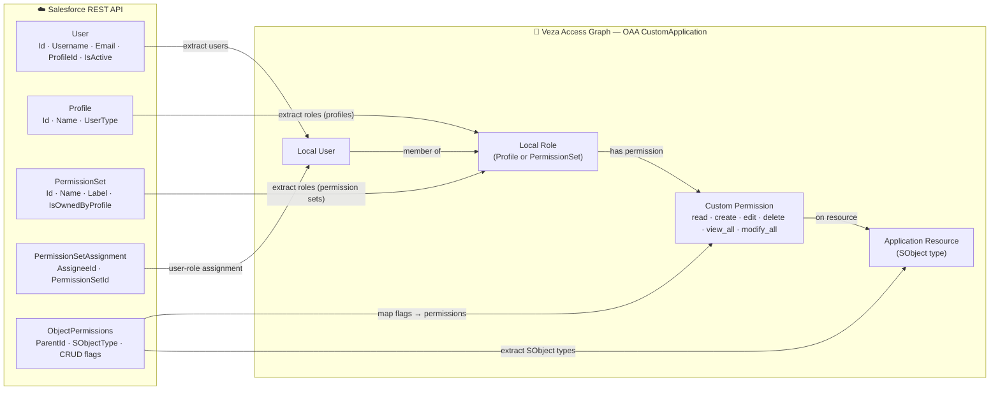

# Salesforce → Veza OAA Integration

## 1. Overview

This connector collects identity and permission data from a Salesforce org via the **REST API** using **OAuth 2.0 Client Credentials** and pushes it to Veza as a `CustomApplication`, making Salesforce access visible in the Veza Access Graph.

### Entities created in Veza

| Source Object | OAA Entity Type | Notes |
|---|---|---|
| Salesforce User | Local User | Standard, PowerPartner, CustomerSuccess types |
| Salesforce Profile | Local Role | All profiles; each user is assigned exactly one |
| Standalone PermissionSet | Local Role | Non-profile-owned permission sets |
| Salesforce SObject type | Application Resource | One resource per unique object type (e.g. Account, Contact) |
| Object-level CRUD flags | Custom Permission | `read`, `create`, `edit`, `delete`, `view_all`, `modify_all` |

### Permission mapping

| Salesforce Flag | OAA Permission | OAA Primitives |
|---|---|---|
| `PermissionsRead` | `read` | `DataRead` |
| `PermissionsCreate` | `create` | `DataRead`, `DataWrite` |
| `PermissionsEdit` | `edit` | `DataRead`, `DataWrite` |
| `PermissionsDelete` | `delete` | `DataRead`, `DataWrite` |
| `PermissionsViewAllRecords` | `view_all` | `DataRead`, `MetadataRead` |
| `PermissionsModifyAllRecords` | `modify_all` | `DataRead`, `DataWrite`, `MetadataRead`, `MetadataWrite` |

---

## 2. Entity Relationship Map



---

## 3. How It Works

1. **Authenticate** — obtains an OAuth 2.0 access token from `SF_TOKEN_URL` using client credentials (`client_id` + `client_secret`).
2. **Fetch Users** — SOQL query for active/standard Salesforce users; captures `Username`, `Email`, `ProfileId`, `IsActive`.
3. **Fetch Profiles** — all Salesforce Profiles; these become Local Roles and are assigned to users via their `ProfileId`.
4. **Fetch PermissionSets** — all permission sets; profile-owned sets are mapped back to their parent Profile role; standalone sets become additional Local Roles.
5. **Fetch PermissionSetAssignments** — non-profile assignments; used to add additional role memberships to users.
6. **Fetch ObjectPermissions** — CRUD flags per `(PermissionSet, SObjectType)` pair; each unique SObject type becomes an Application Resource.
7. **Build OAA Payload** — assembles a `CustomApplication` with users, roles, resources, and permissions.
8. **Push to Veza** — calls `OAAClient.push_application()` with `create_provider=True`; logs any warnings from Veza.

---

## 4. Prerequisites

| Requirement | Detail |
|---|---|
| Python | 3.9+ |
| Network | HTTPS outbound to Salesforce instance URL and token URL; HTTPS outbound to Veza tenant |
| Salesforce | Connected App with OAuth 2.0 enabled, **Client Credentials Flow** turned on, and the integration user assigned to the app |
| Salesforce permissions | The Connected App's running user must have `API Enabled`, `View All Data` or equivalent profile/permission set |
| Veza | API key with `push` permissions for the OAA provider |

---

## 5. Quick Start

```bash
curl -fsSL https://raw.githubusercontent.com/<org>/<repo>/main/integrations/salesforce/install_salesforce.sh | bash
```

After installation, edit the generated `.env` and run:

```bash
cd /opt/VEZA/salesforce-veza/scripts
./venv/bin/python3 salesforce.py --env-file .env --dry-run --save-json
```

---

## 6. Manual Installation

### RHEL / Amazon Linux

```bash
sudo dnf install -y python3 python3-pip git
git clone https://github.com/<org>/<repo>.git /opt/VEZA/salesforce-veza/repo
cd /opt/VEZA/salesforce-veza/repo/integrations/salesforce
python3 -m venv venv
./venv/bin/pip install -r requirements.txt
cp .env.example /opt/VEZA/salesforce-veza/scripts/.env
chmod 600 /opt/VEZA/salesforce-veza/scripts/.env
```

### Ubuntu / Debian

```bash
sudo apt-get update && sudo apt-get install -y python3 python3-pip python3-venv git
git clone https://github.com/<org>/<repo>.git /opt/VEZA/salesforce-veza/repo
cd /opt/VEZA/salesforce-veza/repo/integrations/salesforce
python3 -m venv venv
./venv/bin/pip install -r requirements.txt
cp .env.example /opt/VEZA/salesforce-veza/scripts/.env
chmod 600 /opt/VEZA/salesforce-veza/scripts/.env
```

### Configure `.env`

Edit `/opt/VEZA/salesforce-veza/scripts/.env`:

```bash
SF_INSTANCE_URL=https://myorg.my.salesforce.com
SF_TOKEN_URL=https://myorg.my.salesforce.com/services/oauth2/token
SF_CLIENT_ID=3MVG9...
SF_CLIENT_SECRET=ABC123...
# SF_API_VERSION=60.0

VEZA_URL=https://your-company.veza.com
VEZA_API_KEY=veza_...
```

---

## 7. Usage

```bash
./venv/bin/python3 salesforce.py [OPTIONS]
```

| Argument | Required | Values | Default | Description |
|---|---|---|---|---|
| `--env-file` | No | path | `.env` | Path to the `.env` configuration file |
| `--veza-url` | No* | URL | `VEZA_URL` env | Veza tenant URL |
| `--veza-api-key` | No* | string | `VEZA_API_KEY` env | Veza API key |
| `--sf-instance-url` | No* | URL | `SF_INSTANCE_URL` env | Salesforce instance URL |
| `--sf-token-url` | No* | URL | `SF_TOKEN_URL` env | Salesforce OAuth2 token endpoint |
| `--sf-client-id` | No* | string | `SF_CLIENT_ID` env | Salesforce Connected App client ID |
| `--sf-client-secret` | No* | string | `SF_CLIENT_SECRET` env | Salesforce Connected App client secret |
| `--sf-api-version` | No | string | `60.0` | Salesforce REST API version |
| `--provider-name` | No | string | `Salesforce` | Provider name in Veza |
| `--datasource-name` | No | string | SF instance hostname | Datasource name in Veza |
| `--dry-run` | No | flag | off | Build payload without pushing to Veza |
| `--save-json` | No | flag | off | Save OAA payload as JSON for inspection |
| `--log-level` | No | DEBUG/INFO/WARNING/ERROR | `INFO` | Logging verbosity |

*Required unless provided in `.env` or as environment variables.

### Examples

```bash
# Dry-run — validate payload without pushing to Veza
./venv/bin/python3 salesforce.py --env-file .env --dry-run --save-json

# Live push with debug logging
./venv/bin/python3 salesforce.py --env-file .env --log-level DEBUG

# Override provider / datasource names
./venv/bin/python3 salesforce.py --env-file .env \
  --provider-name "Salesforce Production" \
  --datasource-name "prod.my.salesforce.com"
```

---

## 8. Deployment on Linux

### Dedicated service account

```bash
sudo useradd -r -s /bin/bash -m -d /opt/VEZA/salesforce-veza salesforce-veza
sudo chown -R salesforce-veza:salesforce-veza /opt/VEZA/salesforce-veza
sudo chmod 700 /opt/VEZA/salesforce-veza/scripts
sudo chmod 600 /opt/VEZA/salesforce-veza/scripts/.env
```

### SELinux (RHEL)

```bash
getenforce
sudo restorecon -Rv /opt/VEZA/salesforce-veza/scripts/
```

### Cron wrapper script

Create `/opt/VEZA/salesforce-veza/scripts/run_salesforce.sh`:

```bash
#!/usr/bin/env bash
set -euo pipefail
cd /opt/VEZA/salesforce-veza/scripts
./venv/bin/python3 salesforce.py --env-file .env >> /opt/VEZA/salesforce-veza/logs/cron.log 2>&1
```

```bash
chmod +x /opt/VEZA/salesforce-veza/scripts/run_salesforce.sh
```

Create `/etc/cron.d/salesforce-veza`:

```
# Salesforce → Veza OAA Integration — runs daily at 02:00
0 2 * * * salesforce-veza /opt/VEZA/salesforce-veza/scripts/run_salesforce.sh
```

### Log rotation

Create `/etc/logrotate.d/salesforce-veza`:

```
/opt/VEZA/salesforce-veza/logs/*.log {
    daily
    rotate 30
    compress
    missingok
    notifempty
    create 640 salesforce-veza salesforce-veza
}
```

---

## 9. Multiple Instances

To run against multiple Salesforce orgs, use separate `.env` files and stagger cron jobs:

```bash
# Org A — runs at 02:00
0 2 * * * salesforce-veza /opt/VEZA/salesforce-veza/scripts/venv/bin/python3 \
  /opt/VEZA/salesforce-veza/scripts/salesforce.py \
  --env-file /opt/VEZA/salesforce-veza/scripts/.env.org-a \
  --datasource-name org-a.my.salesforce.com

# Org B — runs at 03:00
0 3 * * * salesforce-veza /opt/VEZA/salesforce-veza/scripts/venv/bin/python3 \
  /opt/VEZA/salesforce-veza/scripts/salesforce.py \
  --env-file /opt/VEZA/salesforce-veza/scripts/.env.org-b \
  --datasource-name org-b.my.salesforce.com
```

---

## 10. Security Considerations

- **`.env` permissions** — always `chmod 600 .env`; only the service account should be able to read it.
- **Client secret rotation** — update `SF_CLIENT_SECRET` in `.env` and test with `--dry-run` before the next scheduled run.
- **Veza API key** — generate a dedicated key with minimal permissions (OAA push only); rotate periodically.
- **SELinux / AppArmor** — if enforcing, run `restorecon` after any file moves; test with `--dry-run` to confirm access before enabling cron.
- **Network** — restrict outbound HTTPS to `SF_INSTANCE_URL`, `SF_TOKEN_URL`, and `VEZA_URL` only.

---

## 11. Troubleshooting

### Authentication errors

| Symptom | Likely cause | Fix |
|---|---|---|
| `HTTP 400 invalid_client_credentials` | Client ID or secret wrong | Verify `SF_CLIENT_ID` and `SF_CLIENT_SECRET` in Salesforce Setup → App Manager |
| `HTTP 400 unsupported_grant_type` | Client Credentials Flow not enabled | Enable in Salesforce Setup → App Manager → Edit → Enable Client Credentials Flow |
| `HTTP 401` from Veza | Invalid or expired API key | Generate a new API key in Veza UI → Settings → API Keys |

### Connectivity issues

```bash
# Test Salesforce reachability
curl -v https://your-org.my.salesforce.com/services/data/

# Test OAuth2 token endpoint manually
curl -X POST https://your-org.my.salesforce.com/services/oauth2/token \
  -d "grant_type=client_credentials" \
  -d "client_id=YOUR_CLIENT_ID" \
  -d "client_secret=YOUR_CLIENT_SECRET"
```

### Missing modules

```bash
./venv/bin/pip install -r requirements.txt --upgrade
```

### Veza push warnings

Warnings from Veza (logged at `WARNING` level) typically indicate unknown identity references. Check the log file in `logs/` and verify that `Email` values in Salesforce match identities in your Veza IdP.

### Enable debug logging

```bash
./venv/bin/python3 salesforce.py --env-file .env --dry-run --log-level DEBUG --save-json
```

---

## 12. Changelog

| Version | Date | Notes |
|---|---|---|
| 1.0 | 2026-05-04 | Initial release — Users, Profiles, PermissionSets, ObjectPermissions via OAuth2 Client Credentials |
